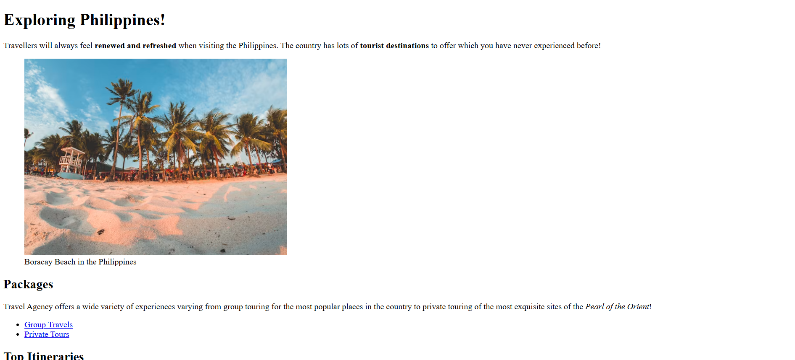

# 📁 Travel Agency

## ℹ️ A simple travel agency landing page

A **HTML-only landing page** for a fictional travel agency promoting tourism in the Philippines. This page is packed with destination highlights, clickable image links, and informative content designed to simulate a lightweight travel brochure-style website.

---

## 🔍 Overview

This landing page showcases the Philippines as a top travel destination. From the iconic beaches of **Boracay** to the stunning **Mayon Volcano** and **Siargao's coconut roads**, the page invites users to explore via linked images and clear descriptions.

---

## ✨ Features

- Semantic HTML structure using `<header>`, `<main>`, `<article>`, `<figure>`, and `<footer>`
- Image-based navigation to key tourist destinations
- Descriptive alt text and image titles for accessibility and SEO
- Emphasis on readability and structure for easy future CSS/JS layering
- Includes Open Graph meta tags for better social sharing previews

---

## 🧠 What I Learned

- Structuring content semantically without relying on CSS or JavaScript
- Making static HTML engaging using figures and links
- Embedding media from external sources responsibly
- Writing accessible, descriptive alt text and captions

---

## 🛠️ Tech Used

- HTML5

---

## 🚀 How to Run

1. Clone the repository
2. Navigate to this project folder
3. Open `Build a Travel Agency Page.html` in your browser

---

## 🌐 Live Demo

Or you can check out the 👉 [live website here](https://sample-projects-html5.netlify.app/pages/build%20a%20travel%20agency%20page/build%20a%20travel%20agency%20page)

---

## 🧑‍💻 Author

Created by **Elmar Chavez**

🗓️ Month/Year: **April 2025**

📚 Journey: **1st** month of learning _frontend web development_.
